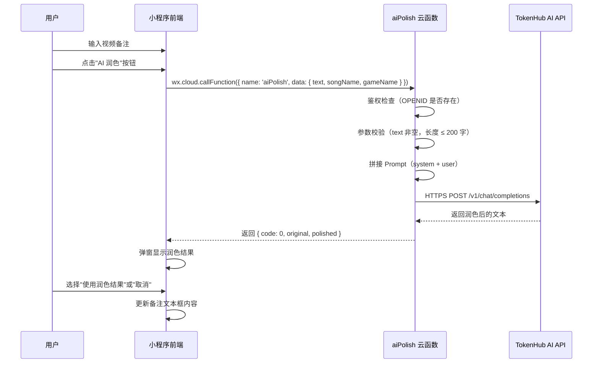

# AI 功能说明文档

## 功能概述

本项目集成了 **AI 润色功能**，允许用户在上传音游练习视频时，对视频备注说明进行 AI 智能润色，使表达更自然、更有趣。

---

## AI 模型

| 项目 | 说明 |
|------|------|
| **AI 平台** | TokenHub AI API（腾讯混元大模型） |
| **模型名称** | `hy3-preview` |
| **API 格式** | OpenAI 兼容格式 |
| **API 地址** | `https://tokenhub.tencentmaas.com/v1/chat/completions` |
| **温度参数** | `temperature: 0.7`（平衡创意与准确性） |
| **最大输出** | `max_tokens: 256` |

---

## 实现的功能

### 核心功能：视频备注 AI 润色

用户在上传视频时，可以输入一段练习备注（如"今天终于 FC 了 Spasmodic"），然后点击"AI 润色"按钮，AI 会优化这段备注的表达，使其更自然、更有趣。

**功能特点**：
- ✅ 保持用户原意不变，只优化表达
- ✅ 使用音游圈常用术语（FC、AP、PM、收歌、手元等）
- ✅ 语气自然，像真实玩家写的
- ✅ 字数控制在 50~150 字之间
- ✅ 可适当使用 emoji 增加趣味性

---

## 用户交互流程



---

## Prompt 设计

### System Prompt（系统提示词）

```
你是一个音游社区的写作助手。你的任务是帮用户润色练习视频的备注说明。
规则：
1. 保持用户原意不变，只优化表达
2. 语气自然、像真实玩家写的，不要太官方
3. 可以适当加入音游圈常用术语（如 FC、AP、PM、收歌、手元 等）
4. 保留关键信息（难点位置、练习目标等）
5. 字数控制在 50~150 字之间
6. 不要加标题，直接输出润色后的内容
7. 可以适当使用 emoji 增加趣味性，但不要过度
```

### User Prompt（用户输入）

```
请帮我润色这段音游练习备注：{text}
歌曲：{songName}
音游：{gameName}
```

**说明**：
- `text`：用户原始备注（必填）
- `songName`：歌曲名称（可选，用于上下文）
- `gameName`：音游名称（可选，用于上下文）

---

## 安全措施

### 1. 鉴权校验

```javascript
const { OPENID } = cloud.getWXContext();
if (!OPENID) {
  return { code: -1, msg: '未授权调用' };
}
```

**作用**：防止未登录用户调用 AI 功能，避免滥用。

### 2. 输入长度限制

```javascript
if (text.trim().length > 200) {
  return { code: -1, msg: '备注内容不能超过200字' };
}
```

**作用**：防止用户输入过长文本，避免 AI API 费用过高。

### 3. API Key 环境变量化

```javascript
const TOKENHUB_API_KEY = process.env.TOKENHUB_API_KEY || '';
if (!TOKENHUB_API_KEY) {
  return { code: -1, msg: '服务配置错误' };
}
```

**作用**：防止 API Key 泄露，确保安全性。

### 4. 请求超时控制

```javascript
req.setTimeout(15000, () => {
  req.destroy();
  reject(new Error('请求超时'));
});
```

**作用**：防止 AI API 响应过慢导致云函数超时（云函数默认超时 10 秒，aiPolish 设置为 20 秒）。

### 5. 错误信息不暴露内部细节

```javascript
return { code: -1, msg: '服务配置错误' };  // 不暴露具体错误原因
```

**作用**：防止攻击者通过错误信息推断系统内部配置。

---

## 错误处理

| 错误码 | 错误信息 | 原因 | 处理方式 |
|--------|---------|------|---------|
| -1 | 未授权调用 | OPENID 为空 | 提示用户先登录 |
| -1 | 服务配置错误 | TOKENHUB_API_KEY 未配置 | 前端禁用 AI 润色按钮 |
| -1 | 请先输入备注内容 | text 为空 | 前端提示用户输入 |
| -1 | 备注内容不能超过200字 | text 超长 | 前端限制输入长度 |
| -2 | AI 服务返回错误 | TokenHub API 返回 error | 提示用户稍后重试 |
| -3 | AI 返回格式异常 | 响应解析失败 | 提示用户稍后重试 |
| -4 | AI 润色失败：xxx | 网络/超时异常 | 提示用户检查网络 |

---

## 前端实现

### 调用示例

```javascript
// pages/upload/upload.js
wx.cloud.callFunction({
  name: 'aiPolish',
  timeout: 20000,  // 超时时间 20 秒
  data: {
    text: this.data.desc,          // 用户原始备注
    songName: this.data.songName,  // 歌曲名称（可选）
    gameName: this.data.gameName   // 音游名称（可选）
  },
  success: res => {
    if (res.result.code === 0) {
      // 显示润色结果
      wx.showModal({
        title: 'AI 润色结果',
        content: res.result.polished,
        showCancel: true,
        confirmText: '使用',
        success: modalRes => {
          if (modalRes.confirm) {
            this.setData({ desc: res.result.polished });
          }
        }
      });
    } else {
      wx.showToast({ title: res.result.msg, icon: 'none' });
    }
  },
  fail: err => {
    wx.showToast({ title: 'AI 润色失败，请稍后重试', icon: 'none' });
  }
});
```

### UI 交互

| 状态 | 显示 |
|------|------|
| 未输入备注 | "AI 润色"按钮置灰 |
| 输入备注后 | "AI 润色"按钮可点击 |
| 调用 AI 中 | 显示 loading 动画 |
| 润色成功 | 弹窗显示润色结果，用户选择"使用"或"取消" |
| 润色失败 | Toast 提示错误信息 |

---

## 成本分析

| 项目 | 说明 |
|------|------|
| **API 调用次数** | 每次用户点击"AI 润色"按钮调用 1 次 |
| **输入 Token** | 约 200 token（用户备注 + prompt） |
| **输出 Token** | 约 100 token（润色后的文本） |
| **费用** | 根据 TokenHub AI 定价计算（通常由平台提供免费额度） |

---

## 未来优化方向

1. **缓存润色结果**：对相同输入返回缓存结果，减少 API 调用次数
2. **支持更多 AI 模型**：允许用户选择不同模型（如 GPT-4、Claude 等）
3. **批量润色**：支持对历史备注批量润色
4. **润色历史记录**：保存用户的润色历史，方便查看
5. **自定义 Prompt**：允许用户自定义润色风格（如"更正式"、"更幽默"等）

---

## 相关文件

| 文件 | 说明 |
|------|------|
| `cloudfunctions/aiPolish/index.js` | AI 润色云函数（核心逻辑） |
| `pages/upload/upload.js` | 上传页面（调用 AI 润色） |
| `pages/upload/upload.wxml` | 上传页面 UI（AI 润色按钮） |
| `docs/api.md` | API 文档（含 aiPolish 接口定义） |
| `docs/api.yaml` | OpenAPI 文档（含 aiPolish 接口定义） |
