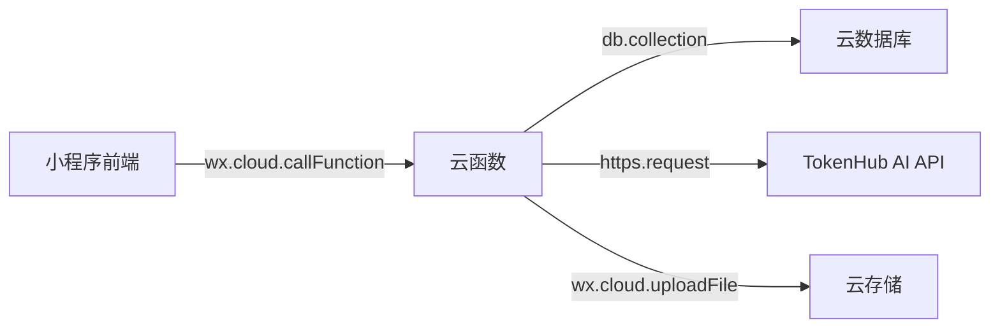

# API 设计与实现文档

## API 架构

本项目基于**微信云开发**，所有 API 通过 `wx.cloud.callFunction()` 调用云函数实现，而非传统的 HTTP REST API。



---

## 调用方式

### 前端调用云函数

```javascript
wx.cloud.callFunction({
  name: '云函数名',
  data: { 参数 },
  success: res => { /* res.result 是云函数返回值 */ },
  fail: err => { /* 错误处理 */ }
})
```

### 前端直接操作数据库

部分操作不通过云函数，前端直接使用 `db.collection()`：

| 操作 | 页面 | 集合 | 说明 |
|------|------|------|------|
| 读取视频列表 | index/category/community | video | 分页查询 |
| 写入视频记录 | upload | video | 上传后写入 |
| 读取评论列表 | player | comment | 分页查询 |
| 写入评论 | player | comment | 发布评论 |
| 收藏/取消收藏 | player | favorite | 切换收藏状态 |
| 读取我的视频 | profile | video | 按 openid 过滤 |
| 读取我的收藏 | profile | favorite | 按 openid 过滤 |
| 删除视频 | profile | video + game + 云存储 | 删除记录 + 减计数 + 删文件 |
| 读取分类 | index/category | game | 分类列表 |
| 初始化分类 | index | game | 首次写入默认分类 |

---

## 云函数 API 定义

### 1. login — 用户登录

**请求**：

| 参数 | 类型 | 必填 | 说明 |
|------|------|------|------|
| — | — | — | 无需传参，自动通过 WXContext 获取 openid |

```javascript
wx.cloud.callFunction({
  name: 'login'
})
```

**成功响应**：

```json
{
  "openid": "oXXXX_xxxx",
  "userInfo": {
    "_id": "doc_id",
    "open_id": "oXXXX_xxxx",
    "app_id": "wxAPPID",
    "nick_name": "匿名用户",
    "avatar_url": "",
    "create_time": "2026-06-01T...",
    "last_login_time": "2026-06-27T..."
  }
}
```

**失败响应**：

```json
{
  "openid": "oXXXX_xxxx",
  "userInfo": null,
  "errorMsg": "登录服务暂时不可用"
}
```

---

### 2. getVideos — 分页查询视频

**请求**：

| 参数 | 类型 | 必填 | 默认值 | 说明 |
|------|------|------|--------|------|
| gameId | string | 否 | "" | 按音游分类过滤 |
| page | number | 否 | 0 | 页码，0 ≤ page ≤ 100 |
| pageSize | number | 否 | 10 | 每页条数，1 ≤ pageSize ≤ 50 |
| sortBy | string | 否 | "createTime" | 排序字段（白名单：createTime / songName） |
| keyword | string | 否 | "" | 搜索关键词，最长 50 字 |

```javascript
wx.cloud.callFunction({
  name: 'getVideos',
  data: {
    gameId: 'game_doc_id',
    page: 0,
    pageSize: 10,
    sortBy: 'createTime',
    keyword: 'Phigros'
  }
})
```

**成功响应**：

```json
{
  "code": 0,
  "data": [
    {
      "_id": "video_doc_id",
      "songName": "Spasmodic",
      "gameId": "game_doc_id",
      "gameName": "Phigros",
      "gameColor": "#6c63ff",
      "desc": "FC 练习记录",
      "videoFileId": "cloud://xxx/videos/xxx/123.mp4",
      "thumbFileId": "cloud://xxx/thumbs/xxx/123.jpg",
      "duration": 180,
      "durationText": "03:00",
      "commentCount": 5,
      "openid": "oXXXX",
      "uploaderName": "匿名用户",
      "uploaderAvatar": "",
      "createTime": "2026-06-01T..."
    }
  ],
  "total": 100,
  "hasMore": true
}
```

**失败响应**：

```json
{
  "code": -1,
  "message": "查询服务暂时不可用"
}
```

---

### 3. addComment — 发布评论

**请求**：

| 参数 | 类型 | 必填 | 说明 |
|------|------|------|------|
| videoId | string | 是 | 视频 ID |
| content | string | 是 | 评论内容，最长 500 字 |
| authorName | string | 否 | 作者昵称，默认"匿名用户"，最长 30 字 |
| authorAvatar | string | 否 | 作者头像 URL |

```javascript
wx.cloud.callFunction({
  name: 'addComment',
  data: {
    videoId: 'video_doc_id',
    content: '太厉害了！',
    authorName: '音游玩家',
    authorAvatar: 'https://xxx/avatar.jpg'
  }
})
```

**成功响应**：

```json
{
  "code": 0,
  "id": "comment_doc_id"
}
```

**失败响应**：

| code | message | 原因 |
|------|---------|------|
| -1 | 未授权调用，请先登录 | OPENID 为空 |
| -1 | 参数不完整 | videoId 或 content 为空 |
| -1 | 评论长度不能超过500字 | content 超长 |
| -1 | 评论服务暂时不可用 | 内部错误 |

---

### 4. getComments — 查询评论列表

**请求**：

| 参数 | 类型 | 必填 | 默认值 | 说明 |
|------|------|------|--------|------|
| videoId | string | 是 | — | 视频 ID |
| page | number | 否 | 0 | 页码，0 ≤ page ≤ 100 |
| pageSize | number | 否 | 20 | 每页条数，1 ≤ pageSize ≤ 50 |

```javascript
wx.cloud.callFunction({
  name: 'getComments',
  data: {
    videoId: 'video_doc_id',
    page: 0,
    pageSize: 20
  }
})
```

**成功响应**：

```json
{
  "code": 0,
  "data": [
    {
      "_id": "comment_doc_id",
      "videoId": "video_doc_id",
      "content": "太厉害了！",
      "open_id": "oXXXX",
      "authorName": "音游玩家",
      "authorAvatar": "https://xxx/avatar.jpg",
      "createTime": "2026-06-01T..."
    }
  ],
  "hasMore": true
}
```

**失败响应**：

| code | message | 原因 |
|------|---------|------|
| -1 | videoId 不能为空 | 必填参数缺失 |
| -1 | 查询服务暂时不可用 | 内部错误 |

---

### 5. aiPolish — AI 润色备注

**请求**：

| 参数 | 类型 | 必填 | 说明 |
|------|------|------|------|
| text | string | 是 | 待润色文本，最长 200 字 |
| songName | string | 否 | 歌曲名称（用于上下文） |
| gameName | string | 否 | 音游名称（用于上下文） |

```javascript
wx.cloud.callFunction({
  name: 'aiPolish',
  timeout: 20000,
  data: {
    text: '今天终于 FC 了 Spasmodic',
    songName: 'Spasmodic',
    gameName: 'Phigros'
  }
})
```

**成功响应**：

```json
{
  "code": 0,
  "msg": "润色成功",
  "original": "今天终于 FC 了 Spasmodic",
  "polished": "终于收了 Spasmodic 🎉 这首歌的难点在中间那段16分连打..."
}
```

**失败响应**：

| code | msg | 原因 |
|------|-----|------|
| -1 | 未授权调用 | OPENID 为空 |
| -1 | 服务配置错误 | TOKENHUB_API_KEY 未配置 |
| -1 | 请先输入备注内容 | text 为空 |
| -1 | 备注内容不能超过200字 | text 超长 |
| -2 | AI 服务返回错误 | TokenHub API 返回 error |
| -3 | AI 返回格式异常 | 响应解析失败 |
| -4 | AI 润色失败：xxx | 网络/超时异常 |

---

### 6. health — 健康检查

**请求**：

| 参数 | 类型 | 必填 | 说明 |
|------|------|------|------|
| — | — | — | 无需传参 |

```javascript
wx.cloud.callFunction({
  name: 'health'
})
```

**成功响应**：

```json
{
  "code": 0,
  "data": {
    "status": "healthy",
    "timestamp": "2026-06-27T12:00:00.000Z",
    "version": "1.0.0",
    "env": "development",
    "checks": {
      "database": "connected",
      "envVars": {
        "TOKENHUB_API_KEY": true
      }
    },
    "uptime": 123.456
  }
}
```

**失败响应**：

```json
{
  "code": -1,
  "msg": "健康检查失败",
  "error": "具体错误信息"
}
```

---

## 前端直接数据库操作 API

以下操作前端直接通过 `db.collection()` 实现，不走云函数：

### 视频上传写入

```javascript
db.collection('video').add({
  data: {
    songName, gameId, gameName, gameColor, desc,
    videoFileId, thumbFileId, duration, durationText,
    fileSize, openid, uploaderName, uploaderAvatar,
    commentCount: 0, createTime: db.serverDate()
  }
})
```

### 视频列表查询

```javascript
// 首页最新视频
db.collection('video').orderBy('createTime', 'desc').limit(6).get()

// 分类页过滤
db.collection('video').where({ gameId }).orderBy(sortBy, order).skip(page*pageSize).limit(pageSize).get()

// 个人页
db.collection('video').where({ openid }).orderBy('createTime', 'desc').get()
```

### 搜索查询

```javascript
db.collection('video')
  .where({ songName: db.RegExp({ regexp: keyword, options: 'i' }) })
  .orderBy('createTime', 'desc').limit(30).get()
```

### 评论写入

```javascript
db.collection('comment').add({
  data: { videoId, content, openid, authorName, authorAvatar, createTime: db.serverDate() }
})
```

### 评论查询

```javascript
db.collection('comment')
  .where({ videoId })
  .orderBy('createTime', 'desc')
  .skip(page * pageSize).limit(pageSize).get()
```

### 收藏操作

```javascript
// 添加收藏
db.collection('favorite').add({
  data: { videoId, openid, songName, gameName, gameColor, videoFileId, thumbFileId, uploaderName, duration, durationText, createTime: db.serverDate() }
})

// 取消收藏
db.collection('favorite').doc(favoriteId).remove()

// 查询收藏状态
db.collection('favorite').where({ videoId, openid }).limit(1).get()
```

### 分类查询

```javascript
db.collection('game').orderBy('sort', 'asc').get()

// 初始化分类
db.collection('game').add({ data: { name, icon, color, sort, videoCount: 0 } })

// 更新分类计数
db.collection('game').doc(gameId).update({ data: { videoCount: db.command.inc(1) } })
db.collection('game').doc(gameId).update({ data: { videoCount: db.command.inc(-1) } })
```

### 视频删除

```javascript
// 1. 删除数据库记录
db.collection('video').doc(videoId).remove()

// 2. 更新分类计数
db.collection('game').doc(gameId).update({ data: { videoCount: db.command.inc(-1) } })

// 3. 删除云存储文件
wx.cloud.deleteFile({ fileList: [videoFileId, thumbFileId] })
```

### 云存储操作

```javascript
// 上传文件
wx.cloud.uploadFile({ cloudPath, filePath })

// 获取临时链接（有效期约 2 小时）
wx.cloud.getTempFileURL({ fileList: [fileId1, fileId2] })

// 删除文件
wx.cloud.deleteFile({ fileList: [fileId1, fileId2] })
```

---

## 统一返回格式

### 云函数返回格式

| 场景 | code | 说明 |
|------|------|------|
| 成功 | 0 | 请求处理成功 |
| 客户端错误 | -1 | 参数错误、未授权、配置缺失等 |
| 外部服务错误 | -2 | TokenHub API 返回错误 |
| 格式异常 | -3 | 响应解析失败 |
| 网络异常 | -4 | 超时、连接失败 |

### login 返回格式（特殊）

login 不使用 code 字段，直接返回 `openid` + `userInfo`，因为该函数在 `app.js` 的 `onLaunch` 中调用，需要与前端代码兼容。

---

## API 调用频率限制

微信云开发对每个环境有默认配额限制：

| 资源 | 默认限制 |
|------|---------|
| 云函数调用次数 | 每日 100,000 次 |
| 云数据库读操作 | 每日 50,000 次 |
| 云数据库写操作 | 每日 30,000 次 |
| 云存储容量 | 5 GB |
| 云函数超时 | 默认 10 秒（aiPolish 为 20 秒） |

---

## 错误处理策略

| 错误类型 | 处理方式 |
|---------|---------|
| 云函数调用失败 | 前端 `wx.showToast` 提示用户重试 |
| 参数校验失败 | 云函数返回具体错误信息（如"评论长度不能超过500字"） |
| 未授权调用 | 返回 `"未授权调用，请先登录"` |
| 内部错误 | 返回通用提示 `"服务暂时不可用"`，不暴露内部细节 |
| AI 服务错误 | 按 code 区分（-2 API错误 / -3 格式异常 / -4 网络异常） |
