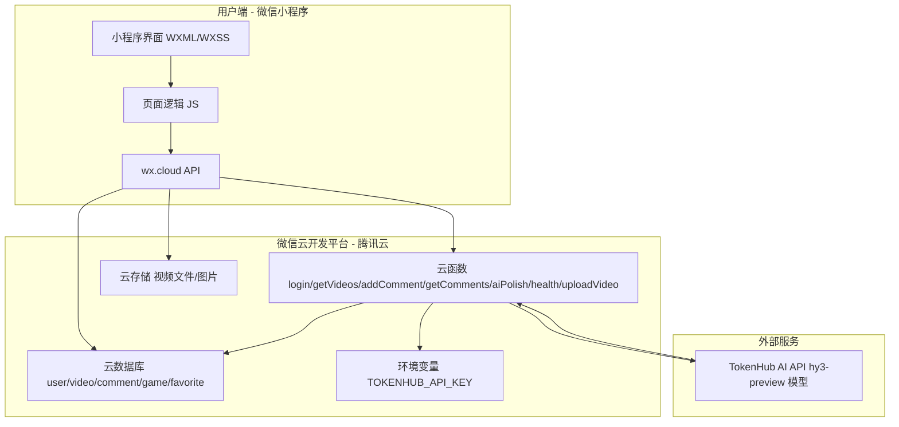
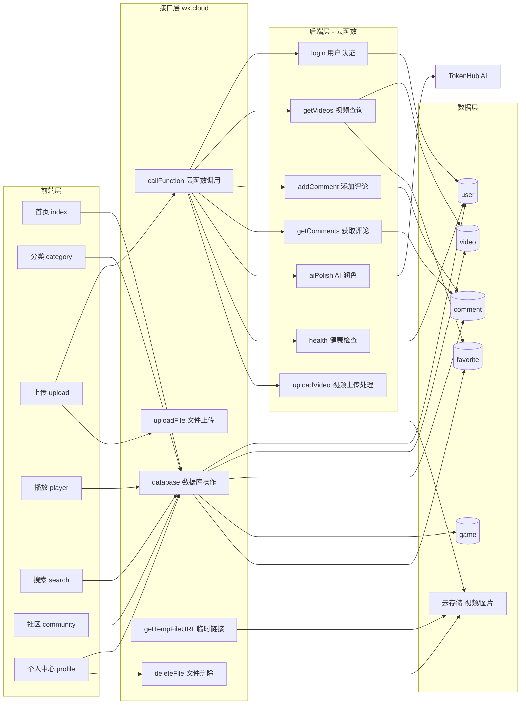
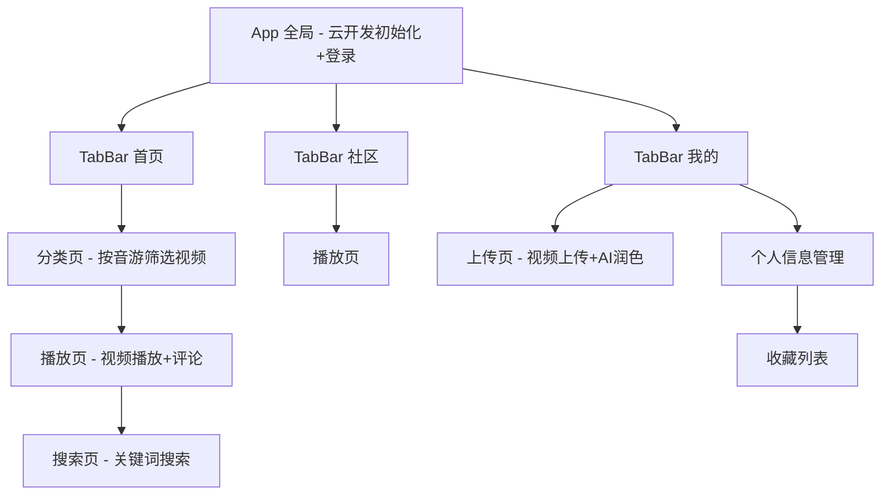
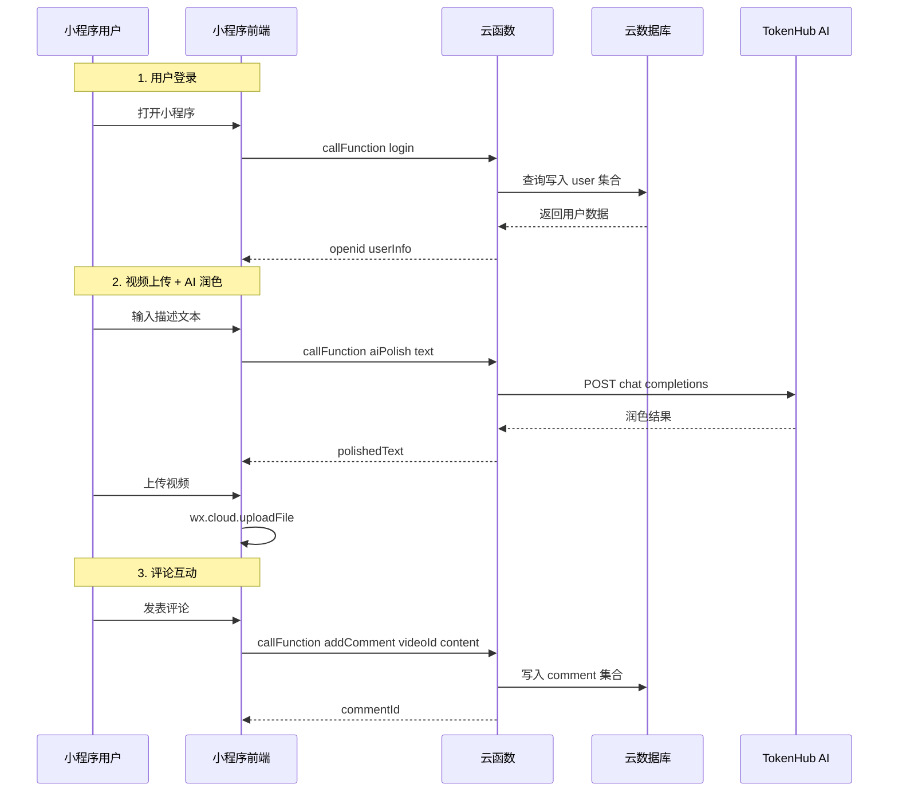
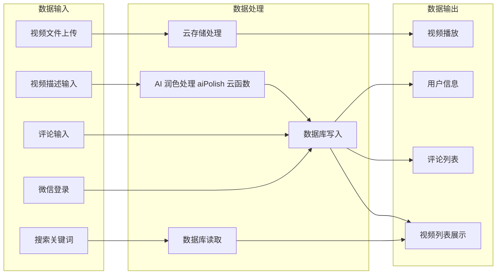
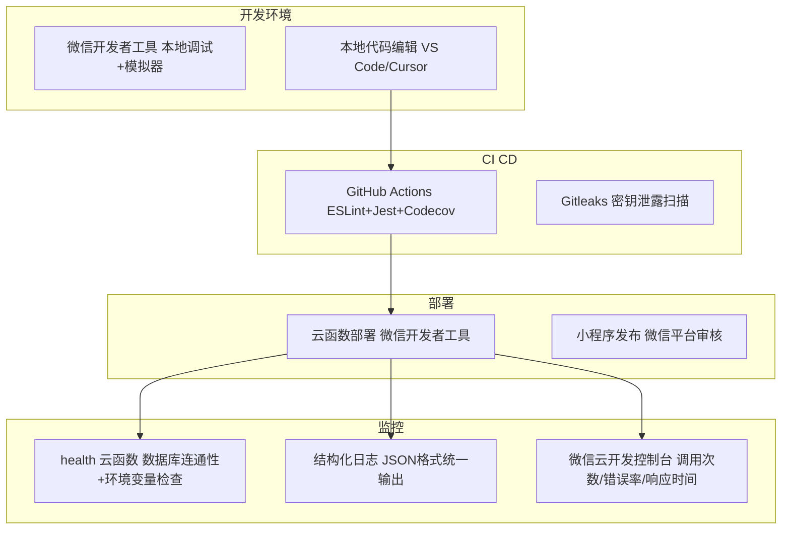
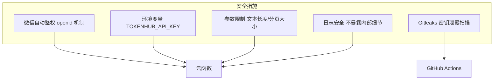

# 音游视频练习辅助小程序 — 架构设计文档

## 1. 系统总体架构

本项目基于 **微信小程序 + 微信云开发** 构建，采用前后端分离的 Serverless 架构，无需自建服务器。

### 架构总览图

### 架构分层图

---

## 2. 前端架构

### 页面结构

### TabBar 配置

| Tab | 页面路径 | 功能 |
|-----|---------|------|
| 首页 | `pages/index/index` | 视频列表 + 分类筛选 |
| 社区 | `pages/community/community` | 社区动态 + 评论 |
| 我的 | `pages/profile/profile` | 个人中心 + 收藏 + 上传 |

### 页面与数据交互方式

| 页面 | 数据交互方式 | 说明 |
|------|-------------|------|
| index | `wx.cloud.database()` | 直接读取 video/game 集合 |
| category | `wx.cloud.database()` | 直接读取 video 集合（按游戏筛选） |
| upload | `wx.cloud.callFunction('aiPolish')` + `wx.cloud.uploadFile()` | AI 润色用云函数，上传用云存储 |
| player | `wx.cloud.database()` + `wx.cloud.getTempFileURL()` | 读取视频 + 获取临时链接 |
| search | `wx.cloud.database()` | 正则搜索 video 集合 |
| community | `wx.cloud.database()` | 读取 video + comment 集合 |
| profile | `wx.cloud.database()` + `wx.cloud.deleteFile()` | 管理视频 + 删除云存储文件 |

---

## 3. 后端架构

### 云函数一览

| 云函数 | 入口参数 | 返回格式 | 功能 |
|--------|---------|---------|------|
| `login` | 无 | `{ openid, userInfo }` | 获取 openid，写入/查询 user 集合 |
| `getVideos` | `{ game, page, pageSize }` | `{ list, total }` | 查询视频列表（支持分页和筛选） |
| `addComment` | `{ videoId, content }` | `{ commentId }` | 添加评论到 comment 集合 |
| `getComments` | `{ videoId }` | `{ list }` | 获取某视频的所有评论 |
| `aiPolish` | `{ text }` | `{ polishedText }` | 调用 TokenHub AI API 润色描述 |
| `health` | 无 | `{ status, checks }` | 健康检查（数据库连通性 + 环境变量） |
| `uploadVideo` | `{ ... }` | `{ ... }` | 视频上传后续处理 |

### 云函数调用链

---

## 4. 数据流架构

---

## 5. 运维架构

---

## 6. 技术选型说明

| 层级 | 技术 | 选择原因 |
|------|------|---------|
| 前端 | 微信小程序 WXML/WXSS/JS | 目标平台是微信，原生开发性能最优 |
| 后端 | 微信云开发（Serverless） | 无需自建服务器，自动扩缩容，开发成本低 |
| 数据库 | 云数据库（MongoDB 兼容） | 云开发内置，无需运维，文档型适合视频数据 |
| 存储 | 云存储 | 云开发内置，支持视频/图片上传和临时链接 |
| AI | TokenHub API (hy3-preview) | 轻量级文本润色，API Key 环境变量化 |
| 测试 | Jest + Mock | Node.js 生态成熟测试框架，覆盖率 96%+ |
| CI | GitHub Actions | 免费、配置简单、与 GitHub 深度集成 |
| 容器化 | Docker + Docker Compose | 统一开发环境，一键启动测试 |

---

## 7. 安全架构

---

## 8. 架构特点总结

| 特点 | 说明 |
|------|------|
| **Serverless** | 无需自建服务器，云函数按调用计费 |
| **前后端分离** | 小程序前端 + 云函数后端，通过 wx.cloud API 交互 |
| **统一返回格式** | `{ code, data/message }` 便于前端统一处理 |
| **结构化日志** | JSON 格式日志，便于监控和分析 |
| **安全优先** | API Key 环境变量化 + 参数限制 + CI 密钥扫描 |
| **高测试覆盖** | 49 个测试，覆盖率 96%+ |
