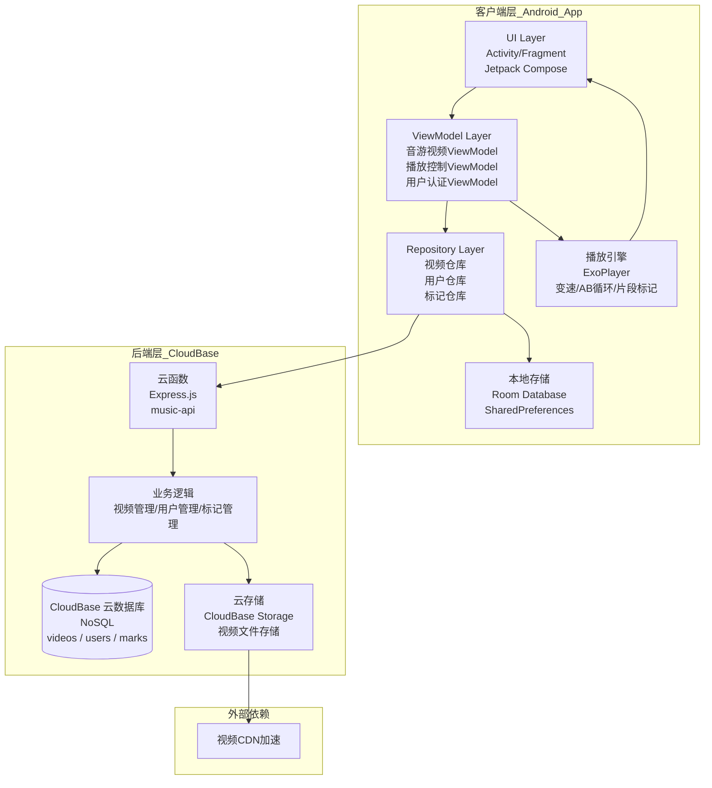

# 音游视频练习助手 - 系统架构设计文档

## 1. 系统架构图

------

## 2. 客户端层（Android 端）

| 模块                 | 技术实现                 | 职责说明                                                     |
| :------------------- | :----------------------- | :----------------------------------------------------------- |
| **UI Layer**         | Jetpack Compose          | 构建视频列表、播放器控制、分类管理界面                       |
| **ViewModel Layer**  | Android ViewModel        | VideoListViewModel、PlayerViewModel、AuthViewModel 管理各模块状态 |
| **Repository Layer** | Repository 模式          | VideoRepository、UserRepository、MarkRepository 统一数据源接口 |
| **本地存储**         | Room + SharedPreferences | 存储视频元数据、标记点、播放进度、用户偏好、用户凭证         |
| **播放引擎**         | ExoPlayer                | 支持变速播放（0.5x–2.0x）、AB循环、片段标记                  |

------

## 3. 后端层（CloudBase 云开发）

| 接口                           | 方法   | 功能说明                 |
| :----------------------------- | :----- | :----------------------- |
| **视频相关**                   |        |                          |
| `/api/videos`                  | GET    | 获取视频列表（支持分页） |
| `/api/videos`                  | POST   | 创建视频记录             |
| `/api/videos/:id`              | GET    | 获取单个视频详情         |
| `/api/videos/:id`              | DELETE | 删除视频                 |
| `/api/videos/search?gameName=` | GET    | 按游戏名称查询           |
| **用户相关**                   |        |                          |
| `/api/auth/register`           | POST   | 用户注册                 |
| `/api/auth/login`              | POST   | 用户登录                 |
| `/api/auth/me`                 | GET    | 获取当前用户信息         |
| **标记相关**                   |        |                          |
| `/api/marks`                   | POST   | 创建片段标记             |
| `/api/marks/:videoId`          | GET    | 获取某视频的所有标记     |
| `/api/marks/:id`               | PUT    | 更新标记                 |
| `/api/marks/:id`               | DELETE | 删除标记                 |
| `/api/marks/sync`              | POST   | 批量同步本地标记至云端   |
| **其他**                       |        |                          |
| `/health`                      | GET    | 健康检查                 |

------

## 4. 核心数据流

### 4.1 用户注册与登录流程

1. 用户输入用户名、邮箱、密码
2. Android 端调用 `/api/auth/register` 接口
3. 云函数验证用户名/邮箱是否已存在
4. 密码使用 bcrypt 加密后存入 users 集合
5. 返回 JWT Token 和用户信息
6. 客户端保存 Token 到 SharedPreferences

### 4.2 视频上传流程

1. 用户选择本地视频文件
2. Android 端上传视频至 CloudBase 云存储
3. 获取云存储返回的 fileID
4. 调用云函数 `/api/videos` POST 接口，携带用户 Token
5. 云函数验证 Token，保存视频元数据到 videos 集合
6. 返回成功，UI 刷新列表

### 4.3 视频播放与 AB 循环

1. 用户点击视频，ViewModel 获取视频 URL
2. Player 模块初始化 ExoPlayer 并设置播放速度
3. 用户设置 A/B 点，ViewModel 保存标记至本地 Room
4. 用户选择云端同步时调用 `/api/marks` POST 接口
5. 云函数验证 Token，保存标记到 marks 集合
6. ExoPlayer 循环播放 AB 区间

### 4.4 标记同步流程

1. 用户创建/修改/删除标记（本地 Room 存储）
2. 标记状态标记为 `pending`（待同步）
3. 网络恢复时或用户点击同步按钮
4. 批量调用 `/api/marks/sync` 接口
5. 云函数批量处理标记数据
6. 同步成功后更新本地标记状态为 `synced`

## 5.技术栈汇总

| 层级         | 技术选型                                 |
| :----------- | :--------------------------------------- |
| Android 开发 | Kotlin                                   |
| UI 框架      | Jetpack Compose                          |
| 架构模式     | MVVM + Repository                        |
| 本地数据库   | Room                                     |
| 本地数据加密 | SQLCipher（可选）                        |
| 视频播放     | ExoPlayer                                |
| 网络请求     | Retrofit + OkHttp + 拦截器（Token 注入） |
| 异步处理     | Kotlin Coroutines + Flow                 |
| 依赖注入     | Hilt                                     |
| 后端框架     | Express.js (云函数)                      |
| 数据库       | CloudBase 云数据库 (NoSQL)               |
| 身份认证     | JWT（访问令牌 + 刷新令牌）               |
| 密码加密     | bcrypt                                   |
| 云服务       | CloudBase（云函数 + 云存储）             |
| 部署         | CloudBase CLI                            |

------

## 6. 架构设计亮点

| 维度           | 设计要点                                         |
| :------------- | :----------------------------------------------- |
| **架构模式**   | MVVM + Repository，职责分离清晰，便于单元测试    |
| **数据一致性** | Repository 作为单一可信源，Room 缓存支持离线使用 |
| **播放能力**   | ExoPlayer 原生支持变速、自定义循环逻辑           |
| **云端同步**   | 标记点云端存储，支持离线标记 + 延迟同步          |
| **身份认证**   | JWT 无状态认证，支持 Token 自动刷新              |
| **数据安全**   | 密码 bcrypt 加密，传输使用 HTTPS                 |
| **免运维**     | CloudBase 云开发，无需管理服务器                 |
| **可扩展性**   | 模块化设计，便于新增功能模块（如评论、收藏等）   |
