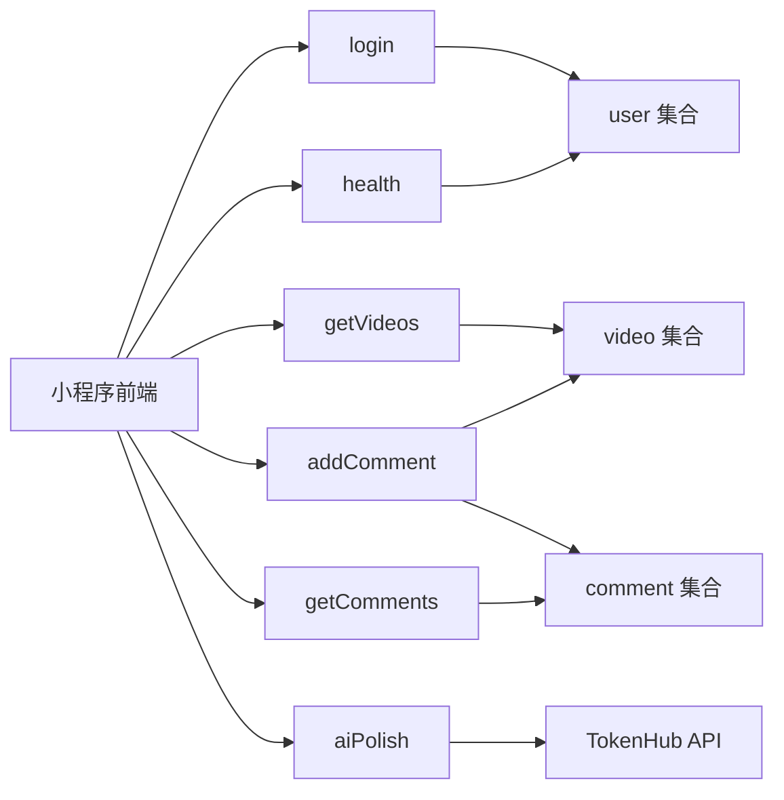

# 后端开发文档

## 技术栈

| 技术 | 说明 |
|------|------|
| 微信云开发 | 云函数 + 云数据库 + 云存储 |
| wx-server-sdk | 微信云开发 SDK |
| Node.js 22.15.0 | 云函数运行环境 |
| TokenHub AI API | 大模型接口（hy3-preview 模型） |

---

## 云函数概览



| 云函数 | 入口参数 | 主要操作 | 调用方式 |
|--------|---------|---------|---------|
| login | 无 | 查询/创建 user 记录 | callFunction |
| getVideos | gameId, page, pageSize, sortBy, keyword | 分页查询 video | callFunction |
| addComment | videoId, content, authorName, authorAvatar | 写入 comment + 更新 video.commentCount | callFunction |
| getComments | videoId, page, pageSize | 分页查询 comment | callFunction |
| aiPolish | text, songName, gameName | 调用 AI API 润色文本 | callFunction |
| health | 无 | 检查数据库连通性 + 环境变量 | callFunction / 云端测试 |

---

## 云函数详细说明

### 1. login — 用户登录与初始化

**路径**：`cloudfunctions/login/index.js`

**功能**：
- 通过 `cloud.getWXContext()` 获取用户 OPENID
- 查询 `user` 集合是否存在该用户
- 首次登录 → 写入新用户记录（open_id, nick_name, avatar_url, create_time, last_login_time）
- 重复登录 → 更新 last_login_time
- 返回 openid 和 userInfo

**返回格式**：
```json
{
  "openid": "oXXXX",
  "userInfo": { "_id": "xxx", "open_id": "oXXXX", "nick_name": "匿名用户", ... }
}
```

**安全措施**：
- 错误时返回通用提示 `"登录服务暂时不可用"`，不暴露内部错误
- 结构化日志记录请求耗时和异常

---

### 2. getVideos — 分页查询视频

**路径**：`cloudfunctions/getVideos/index.js`

**功能**：
- 支持按 `gameId` 过滤分类
- 支持按关键词搜索（`db.RegExp` 正则匹配歌名）
- 支持按 `createTime` 或 `songName` 排序
- 分页查询（skip + limit）

**参数校验**：
| 参数 | 校验规则 |
|------|---------|
| page | 0 ≤ page ≤ 100 |
| pageSize | 1 ≤ pageSize ≤ 50 |
| sortBy | 白名单：`createTime` 或 `songName` |
| keyword | trim + slice(0, 50) |

**返回格式**：
```json
{
  "code": 0,
  "data": [...],
  "total": 100,
  "hasMore": true
}
```

---

### 3. addComment — 发布评论

**路径**：`cloudfunctions/addComment/index.js`

**功能**：
- 验证参数完整性（videoId + content）
- 长度限制：content ≤ 500 字，authorName ≤ 30 字
- 写入 `comment` 集合
- 更新 `video` 集合的 `commentCount`（+1）

**安全措施**：
- OPENID 鉴权校验：拒绝未登录调用
- 输入净化：trim + 长度限制
- 错误信息不暴露内部细节

**返回格式**：
```json
{ "code": 0, "id": "comment_id" }
```

---

### 4. getComments — 查询评论列表

**路径**：`cloudfunctions/getComments/index.js`

**功能**：
- 按 videoId 过滤
- 按 createTime 降序排列
- 分页查询

**参数校验**：
| 参数 | 校验规则 |
|------|---------|
| videoId | 必填，trim |
| page | 0 ≤ page ≤ 100 |
| pageSize | 1 ≤ pageSize ≤ 50 |

**返回格式**：
```json
{
  "code": 0,
  "data": [...],
  "hasMore": true
}
```

---

### 5. aiPolish — AI 润色备注

**路径**：`cloudfunctions/aiPolish/index.js`

**功能**：
- 调用 TokenHub AI API（模型 hy3-preview）
- 将用户输入的备注润色为更自然的音游社区风格
- 返回润色后的文本

**Prompt 设计**：
- System Prompt：7 条规则（保持原意、自然语气、音游术语、50~150 字、不加标题、适当 emoji）
- User Prompt：拼接原始文本 + 歌名 + 音游名

**安全措施**：
| 措施 | 说明 |
|------|------|
| OPENID 鉴权 | 拒绝未登录调用 |
| API Key 环境变量 | `process.env.TOKENHUB_API_KEY`，不硬编码 |
| Key 检查 | 未配置时返回 `"服务配置错误"` |
| 输入长度限制 | text ≤ 200 字 |
| 请求超时 | 15 秒超时保护 |
| 错误信息 | 不暴露 API Key 或内部细节 |

**返回格式**：
```json
{
  "code": 0,
  "msg": "润色成功",
  "original": "原始文本",
  "polished": "润色后文本"
}
```

**错误码**：
| code | msg | 原因 |
|------|-----|------|
| -1 | 未授权调用 / 请先输入 / 服务配置错误 | 鉴权/参数/配置 |
| -2 | AI 服务返回错误 | TokenHub API 错误 |
| -3 | AI 返回格式异常 | 响应解析失败 |
| -4 | AI 润色失败：xxx | 网络/超时异常 |

---

### 6. health — 健康检查

**路径**：`cloudfunctions/health/index.js`

**功能**：
- 检查数据库连通性（查询 `user` 集合 limit 1）
- 检查环境变量配置（TOKENHUB_API_KEY 是否存在）
- 返回服务状态信息

**返回格式**：
```json
{
  "code": 0,
  "data": {
    "status": "healthy",
    "timestamp": "2026-06-18T...",
    "version": "1.0.0",
    "env": "development",
    "checks": {
      "database": "connected",
      "envVars": { "TOKENHUB_API_KEY": true }
    },
    "uptime": 123.45
  }
}
```

**触发方式**：
- 云端测试：云开发控制台 → 云函数 → 点击"云端测试"
- 代码调用：`wx.cloud.callFunction({ name: 'health' })`

---

## 结构化日志规范

所有云函数统一使用 `structuredLog` 函数输出日志：

```javascript
function structuredLog(level, message, extra = {}) {
  const entry = {
    time: new Date().toISOString(),
    level: level,           // INFO | WARN | ERROR
    service: 'login',       // 各云函数名称
    message: message,
    ...extra                // 扩展字段
  };
  if (level === 'ERROR') console.error(JSON.stringify(entry));
  else if (level === 'WARN') console.warn(JSON.stringify(entry));
  else console.log(JSON.stringify(entry));
}
```

**日志级别**：

| 级别 | 使用场景 |
|------|---------|
| INFO | 请求开始、成功完成、正常操作 |
| WARN | 未授权调用、参数异常、非致命错误 |
| ERROR | 请求失败、数据库异常、API 错误 |

**必须记录的扩展字段**：
- `durationMs`：请求耗时（毫秒）
- `error`：错误信息（仅 ERROR 级别）

---

## 云函数配置文件

每个云函数目录下需要 `config.json`：

```json
{
  "timeout": 10,
  "envVariables": {},
  "runtime": "Nodejs22.15.0",
  "memorySize": 256,
  "installDependency": true
}
```

**aiPolish 特殊配置**：
```json
{
  "timeout": 20,
  "envVariables": {
    "TOKENHUB_API_KEY": ""
  },
  "runtime": "Nodejs22.15.0",
  "memorySize": 256,
  "installDependency": true
}
```

> TOKENHUB_API_KEY 的实际值需在**云开发控制台 → 云函数 → 环境变量**中配置

---

## 环境变量

| 变量名 | 作用 | 配置位置 |
|--------|------|---------|
| TOKENHUB_API_KEY | TokenHub AI API 密钥 | 云开发控制台环境变量 |
| NODE_ENV | 运行环境标识（可选） | 云开发控制台环境变量 |

---

## 数据库集合操作汇总

| 云函数 | 集合 | 操作类型 |
|--------|------|---------|
| login | user | read / write |
| getVideos | video | read |
| addComment | comment | write |
| addComment | video | update (commentCount +1) |
| getComments | comment | read |
| health | user | read (limit 1) |

> 部分前端页面也直接操作数据库（如 profile 页删除视频、收藏操作），不通过云函数中转。

---

## 安全措施汇总

| 安全措施 | 涉及云函数 | 说明 |
|---------|-----------|------|
| 鉴权校验 | addComment, aiPolish | 检查 OPENID，拒绝未授权调用 |
| 参数校验 | getVideos, addComment, getComments, aiPolish | 范围限制、白名单、长度限制 |
| API Key 环境变量 | aiPolish | 不硬编码，通过 process.env 读取 |
| 错误信息脱敏 | 所有云函数 | 不暴露内部细节，返回通用提示 |
| 结构化日志 | 所有云函数 | JSON 格式日志，便于排查和分析 |
| CI 密钥扫描 | GitHub Actions | Gitleaks 扫描防止密钥泄露 |

---

## 部署方式

1. **云开发控制台**：右键云函数文件夹 → "上传并部署：云端安装依赖"
2. **环境变量配置**：云开发控制台 → 设置 → 环境变量 → 添加 TOKENHUB_API_KEY
3. **config.json**：确保每个云函数目录下有此配置文件
