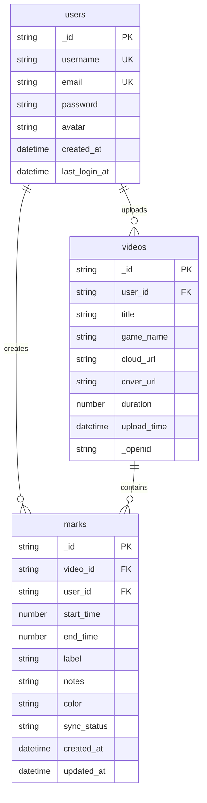

# 音游视频练习助手 - 数据库设计文档

## 1. ER 图

------

## 2. 集合结构详情

### 2.1 users（用户表）

| 字段            | 类型   | 约束             | 说明                         |
| :-------------- | :----- | :--------------- | :--------------------------- |
| `_id`           | String | PRIMARY KEY      | 用户ID（CloudBase 自动生成） |
| `username`      | String | NOT NULL, UNIQUE | 用户名                       |
| `email`         | String | NOT NULL, UNIQUE | 邮箱（用于登录）             |
| `password`      | String | NOT NULL         | 加密密码（bcrypt）           |
| `avatar`        | String |                  | 头像URL                      |
| `created_at`    | Date   | DEFAULT Date.now | 注册时间                     |
| `last_login_at` | Date   |                  | 最后登录时间                 |

------

### 2.2 videos（视频表）

| 字段          | 类型   | 约束                                | 说明                             |
| :------------ | :----- | :---------------------------------- | :------------------------------- |
| `_id`         | String | PRIMARY KEY                         | 视频ID（CloudBase 自动生成）     |
| `user_id`     | String | FOREIGN KEY REFERENCES users(`_id`) | 上传者ID                         |
| `title`       | String | NOT NULL                            | 视频标题                         |
| `game_name`   | String | NOT NULL                            | 游戏名称                         |
| `cloud_url`   | String | NOT NULL                            | 云存储地址                       |
| `cover_url`   | String |                                     | 封面图地址（可选）               |
| `duration`    | Number |                                     | 视频时长（毫秒）                 |
| `upload_time` | Date   | DEFAULT Date.now                    | 上传时间                         |
| `_openid`     | String |                                     | 创建者标识（CloudBase 自动添加） |

------

### 2.3 marks（标记表）

| 字段          | 类型   | 约束                                 | 说明                         |
| :------------ | :----- | :----------------------------------- | :--------------------------- |
| `_id`         | String | PRIMARY KEY                          | 标记ID（CloudBase 自动生成） |
| `video_id`    | String | FOREIGN KEY REFERENCES videos(`_id`) | 关联视频ID                   |
| `user_id`     | String | FOREIGN KEY REFERENCES users(`_id`)  | 创建者ID                     |
| `start_time`  | Number | NOT NULL                             | 起始时间（毫秒）             |
| `end_time`    | Number | NOT NULL                             | 结束时间（毫秒）             |
| `label`       | String |                                      | 标记名称（如“难点段落”）     |
| `notes`       | String |                                      | 备注说明（可选）             |
| `color`       | String | DEFAULT "#FF5722"                    | 标记颜色（可选）             |
| `sync_status` | String | DEFAULT "synced"                     | 同步状态：synced / pending   |
| `created_at`  | Date   | DEFAULT Date.now                     | 创建时间                     |
| `updated_at`  | Date   | DEFAULT Date.now                     | 更新时间                     |

------

## 3. 权限配置

| 集合       | 操作 | 权限         | 说明                            |
| :--------- | :--- | :----------- | :------------------------------ |
| **users**  | 读   | 仅本人可读   | 用户只能查看自己的信息          |
|            | 写   | 仅本人可写   | 用户只能修改自己的信息          |
| **videos** | 读   | 所有用户可读 | 游客可查看视频列表              |
|            | 写   | 仅创建者可写 | 用户只能修改/删除自己上传的视频 |
| **marks**  | 读   | 仅本人可读   | 用户只能查看自己的标记          |
|            | 写   | 仅本人可写   | 用户只能修改/删除自己的标记     |

------

## 4. 表关系说明

| 关系               | 类型   | 说明                       |
| :----------------- | :----- | :------------------------- |
| **users → videos** | 一对多 | 一个用户可以上传多个视频   |
| **users → marks**  | 一对多 | 一个用户可以创建多个标记   |
| **videos → marks** | 一对多 | 一个视频可以包含多个标记点 |

## 5. 索引设计（提升查询性能）

| 集合   | 索引字段             | 类型     | 说明               |
| :----- | :------------------- | :------- | ------------------ |
| users  | `username`           | 唯一索引 | 用户名快速查询     |
| users  | `email`              | 唯一索引 | 邮箱快速登录       |
| videos | `game_name`          | 普通索引 | 按游戏名称筛选     |
| videos | `upload_time`        | 降序索引 | 按时间排序         |
| videos | `user_id`            | 普通索引 | 查询用户视频列表   |
| marks  | `video_id`           | 普通索引 | 查询视频的所有标记 |
| marks  | `user_id`            | 普通索引 | 查询用户的所有标记 |
| marks  | `video_id + user_id` | 复合索引 | 联合查询优化       |
