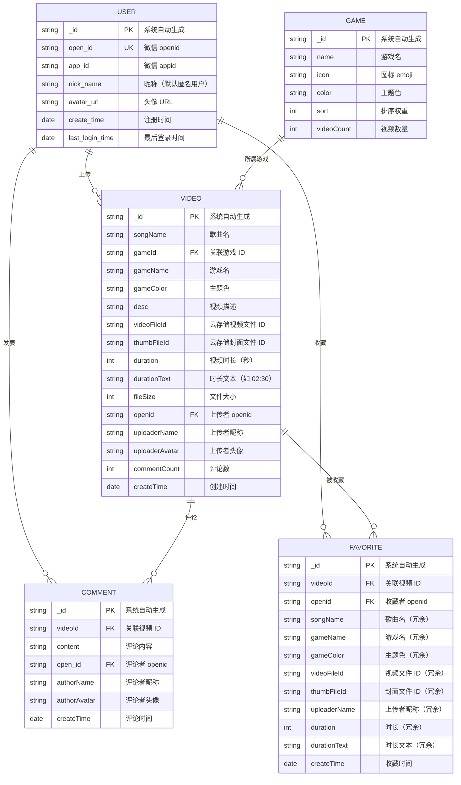
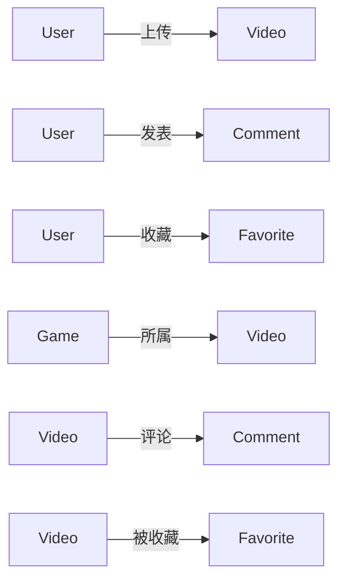

# 音游视频练习辅助小程序 — 数据库设计文档

## 1. 数据库概述

本项目使用 **微信云数据库**（MongoDB 兼容的文档型数据库），共 5 个集合：

| 集合名 | 用途 | 主要访问方式 |
|--------|------|-------------|
| `user` | 用户信息 | 云函数 login（写入/查询） |
| `video` | 视频记录 | 前端直读 + 云函数 getVideos（查询）、upload（写入）、profile（删除） |
| `comment` | 评论 | 云函数 addComment（写入）、getComments（查询）、前端直读 |
| `game` | 音游分类 | 前端直读 + upload（写入） |
| `favorite` | 收藏记录 | 前端直读直写（player/profile 页面） |

---

## 2. ER 图（实体关系图）

---

## 3. 集合详细设计

### 3.1 user 集合

**用途**：存储用户基本信息，由 `login` 云函数自动写入

| 字段 | 类型 | 必填 | 说明 |
|------|------|------|------|
| `_id` | String | 自动 | 系统自动生成的文档 ID（主键） |
| `open_id` | String | ✅ | 微信 openid（唯一标识） |
| `app_id` | String | ✅ | 微信 appid |
| `nick_name` | String | ✅ | 昵称，默认 `"匿名用户"` |
| `avatar_url` | String | ❌ | 头像 URL，默认空 |
| `create_time` | Date | ✅ | 注册时间，使用 `db.serverDate()` |
| `last_login_time` | Date | ✅ | 最后登录时间，每次登录更新 |

**索引建议**：
- `open_id`（唯一索引） — login 云函数通过 openid 查询用户

**写入来源**：
- `login` 云函数：首次登录时 `add`，重复登录时 `update` last_login_time

---

### 3.2 video 集合

**用途**：存储视频记录，是核心业务集合

| 字段 | 类型 | 必填 | 说明 |
|------|------|------|------|
| `_id` | String | 自动 | 文档 ID（主键） |
| `songName` | String | ✅ | 歌曲名 |
| `gameId` | String | ✅ | 所属音游 ID（外键关联 game） |
| `gameName` | String | ✅ | 音游名称 |
| `gameColor` | String | ✅ | 音游主题色（如 `"#6c63ff"`） |
| `desc` | String | ✅ | 视频描述（可经 AI 润色） |
| `videoFileId` | String | ✅ | 云存储视频文件 ID |
| `videoUrl` | String | ❌ | 临时链接（播放时动态获取，不持久化） |
| `thumbFileId` | String | ❌ | 云存储封面图文件 ID |
| `thumbUrl` | String | ❌ | 临时链接（展示时动态获取，不持久化） |
| `duration` | Number | ✅ | 视频时长（秒） |
| `durationText` | String | ✅ | 时长文本（如 `"02:30"`） |
| `fileSize` | Number | ✅ | 文件大小 |
| `openid` | String | ✅ | 上传者 openid（外键关联 user） |
| `uploaderName` | String | ✅ | 上传者昵称 |
| `uploaderAvatar` | String | ❌ | 上传者头像 |
| `commentCount` | Number | ✅ | 评论数，默认 `0`，评论时 `inc(1)` |
| `createTime` | Date | ✅ | 创建时间 |

**索引建议**：
- `gameId` — 按音游筛选视频
- `openid` — 查询某用户上传的视频
- `createTime`（降序） — 按时间排序

**写入来源**：
- `upload` 页面：视频上传后写入
- `addComment` 云函数：评论时 `commentCount` 自增
- `profile` 页面：删除视频时 `remove`
- `profile` 页面：删除视频时同步更新 `game.videoCount`

---

### 3.3 comment 集合

**用途**：存储评论信息

| 字段 | 类型 | 必填 | 说明 |
|------|------|------|------|
| `_id` | String | 自动 | 文档 ID（主键） |
| `videoId` | String | ✅ | 关联视频 ID（外键关联 video） |
| `content` | String | ✅ | 评论内容（限制 500 字） |
| `open_id` | String | ✅ | 评论者 openid（外键关联 user） |
| `authorName` | String | ✅ | 评论者昵称（限制 30 字） |
| `authorAvatar` | String | ❌ | 评论者头像 |
| `createTime` | Date | ✅ | 评论时间 |

**索引建议**：
- `videoId` — 查询某视频的所有评论

**写入来源**：
- `addComment` 云函数：添加评论
- `getComments` 云函数：查询评论列表
- `player` 页面：前端直读评论

**安全限制**：
- 评论内容不超过 500 字（云函数校验）
- 昵称不超过 30 字（云函数截断）
- 未登录用户拒绝评论（云函数鉴权）

---

### 3.4 game 集合

**用途**：存储音游分类信息

| 字段 | 类型 | 必填 | 说明 |
|------|------|------|------|
| `_id` | String | 自动 | 文档 ID（主键） |
| `name` | String | ✅ | 音游名称（如 `"Phigros"`） |
| `icon` | String | ✅ | 图标 emoji（如 `"🎵"`） |
| `color` | String | ✅ | 主题色（如 `"#6c63ff"`） |
| `sort` | Number | ✅ | 排序权重 |
| `videoCount` | Number | ❌ | 该分类下的视频数量 |

**预置数据**（7 个音游分类）：

| name | icon | color | sort |
|------|------|-------|------|
| Phigros | 🎵 | #6c63ff | 1 |
| Arcaea | 🌸 | #e91e8c | 2 |
| Cytus II | 🎭 | #00bcd4 | 3 |
| Malody | 🎸 | #ff9800 | 4 |
| Lanota | 🌊 | #4caf50 | 5 |
| Dynamix | ⚡ | #f44336 | 6 |
| 其他 | 🎮 | #9e9e9e | 7 |

**索引建议**：
- `sort`（升序） — 按排序权重查询

**写入来源**：
- `index` 页面：首次加载时自动初始化（`add`）
- `upload` 页面：上传视频时 `videoCount` 自增
- `profile` 页面：删除视频时 `videoCount` 自减

---

### 3.5 favorite 集合

**用途**：存储收藏记录（用户与视频的多对多关系）

| 字段 | 类型 | 必填 | 说明 |
|------|------|------|------|
| `_id` | String | 自动 | 文档 ID（主键） |
| `videoId` | String | ✅ | 关联视频 ID（外键关联 video） |
| `openid` | String | ✅ | 收藏者 openid（外键关联 user） |
| `songName` | String | ✅ | 歌曲名（冗余字段，便于列表展示） |
| `gameName` | String | ✅ | 游戏名（冗余字段） |
| `gameColor` | String | ✅ | 主题色（冗余字段） |
| `videoFileId` | String | ✅ | 视频文件 ID（冗余字段） |
| `thumbFileId` | String | ❌ | 封面文件 ID（冗余字段） |
| `uploaderName` | String | ❌ | 上传者昵称（冗余字段） |
| `duration` | Number | ❌ | 时长（冗余字段） |
| `durationText` | String | ❌ | 时长文本（冗余字段） |
| `createTime` | Date | ✅ | 收藏时间 |

**索引建议**：
- `openid` — 查询某用户的收藏列表
- `videoId + openid`（复合唯一索引） — 防止重复收藏

**冗余设计说明**：
`favorite` 集合存储了视频的部分字段（songName、gameName 等），这是为了：
1. 收藏列表展示时**不需要再查询 video 集合**，减少数据库调用次数
2. 云数据库不支持 JOIN 查询，冗余是常见的优化手段

**写入来源**：
- `player` 页面：收藏/取消收藏
- `profile` 页面：收藏列表展示、取消收藏

---

## 4. 实体关系说明

### 关系汇总

| 关系 | 类型 | 说明 |
|------|------|------|
| User → Video | 一对多 | 一个用户可上传多个视频 |
| User → Comment | 一对多 | 一个用户可发表多条评论 |
| User → Favorite | 一对多 | 一个用户可收藏多个视频 |
| Game → Video | 一对多 | 一个音游分类下有多个视频 |
| Video → Comment | 一对多 | 一个视频有多条评论 |
| Video → Favorite | 一对多 | 一个视频可被多人收藏 |
| User ↔ Video（通过 Favorite） | 多对多 | 用户和视频通过 favorite 集合实现多对多 |

---

## 5. 数据流图

```mermaid
flowchart TD
    subgraph 写入操作["写入操作"]
        W1[login 云函数] -->|add/update| U[user 集合]
        W2[upload 页面] -->|add| V[video 集合]
        W3[upload 页面] -->|inc videoCount| G[game 集合]
        W4[addComment 云函数] -->|add| C[comment 集合]
        W4 -->|inc commentCount| V
        W5[player 页面] -->|add/remove| F[favorite 集合]
        W6[upload 页面] -->|uploadFile| S[云存储]
    end

    subgraph 读取操作["读取操作"]
        R1[index 页面] -->|读取| G
        R1 -->|读取| V
        R2[category 页面] -->|按 gameId 读取| V
        R3[player 页面] -->|读取| V
        R3 -->|读取| C
        R3 -->|读取| F
        R4[search 页面] -->|正则搜索| V
        R5[community 页面] -->|读取| V
        R6[profile 页面] -->|读取| V
        R6 -->|读取| F
        R7[所有页面] -->|getTempFileURL| S
    end

    subgraph 删除操作["删除操作"]
        D1[profile 页面] -->|remove| V
        D1 -->|dec videoCount| G
        D1 -->|deleteFile| S
        D2[profile 页面] -->|remove| F
    end
```

---

## 6. 云存储设计

| 存储类型 | 说明 | 获取方式 |
|---------|------|---------|
| 视频文件 | 用户上传的练习视频 | `wx.cloud.uploadFile()` 上传，`wx.cloud.getTempFileURL()` 获取临时链接 |
| 封面图片 | 视频缩略图 | 同上 |

**临时链接机制**：
- 云存储文件 ID（`fileID`）是永久标识，存入数据库
- 播放/展示时通过 `getTempFileURL()` 动态获取临时 HTTP 链接
- 临时链接有有效期，过期后需重新获取
- **不在数据库中存储临时链接**（`videoUrl` 和 `thumbUrl` 字段为空字符串）

---

## 7. 数据安全

| 安全措施 | 说明 |
|---------|------|
| 云函数鉴权 | `addComment` 云函数校验 `OPENID`，拒绝未登录调用 |
| 输入参数限制 | 评论内容 ≤ 500 字，昵称 ≤ 30 字 |
| 输入净化 | 云函数对 `authorName` 和 `videoId` 做 `trim()` + `slice()` 处理 |
| 错误信息不暴露 | 云函数 catch 中返回通用提示，不暴露内部错误详情 |
| 环境变量 | `TOKENHUB_API_KEY` 通过 `process.env` 读取，不硬编码 |
| 紧急停止机制 | `aiPolish` 云函数含 `EMERGENCY_STOP` 标志，可一键禁用 AI 功能 |

---

## 8. 设计特点总结

| 特点 | 说明 |
|------|------|
| **文档型数据库** | 云数据库兼容 MongoDB，灵活的 JSON 文档结构 |
| **冗余设计** | favorite 集合冗余存储视频字段，减少查询次数 |
| **ServerDate** | 使用 `db.serverDate()` 确保时间戳由服务器生成 |
| **command.inc** | 使用 `db.command.inc()` 增减计数，避免并发问题 |
| **临时链接** | 不持久化云存储临时 URL，动态获取 |
| **前端直读** | 大部分数据通过前端 `wx.cloud.database()` 直接读取，无需云函数中转 |
