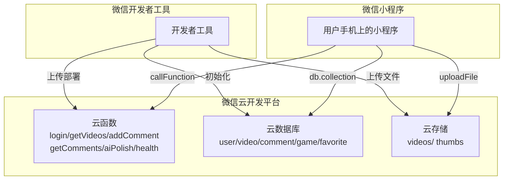

# 云服务部署说明文档

## 部署概述

本项目基于**微信云开发**（微信小程序云开发），无需自建服务器，所有后端服务（云函数、云数据库、云存储）均由微信云开发平台托管。

---

## 部署架构



---

## 部署前准备

### 1. 注册微信小程序账号

- 访问 [微信公众平台](https://mp.weixin.qq.com/)
- 注册小程序账号（需要邮箱验证）
- 获取 **AppID**（在"开发管理" → "开发设置" 中查看）

### 2. 安装微信开发者工具

- 下载地址：<https://developers.weixin.qq.com/miniprogram/dev/devtools/download.html>
- 安装后使用微信扫码登录

### 3. 创建云开发环境

- 打开微信开发者工具
- 点击顶部 **"云开发"** 按钮
- 创建云开发环境（选择"按量计费"或"基础版"）
- 记录 **环境 ID**（如 `cloud1-xxxxxx`）

---

## 部署步骤

### 步骤 1：配置项目

**1.1 修改 `project.config.json`**

```json
{
  "appid": "你的AppID",
  "cloudfunctionRoot": "cloudfunctions/",
  "miniprogramRoot": "./"
}
```

**1.2 修改 `app.js` 中的环境 ID**

```javascript
// app.js 第 10 行
cloud.init({
  env: '你的环境ID'  // 替换成你的云开发环境 ID
});
```

---

### 步骤 2：部署云函数

**2.1 逐个部署云函数**

在微信开发者工具中：

1. 左侧文件树，找到 `cloudfunctions/` 文件夹
2. **右键点击** `login` 文件夹
3. 选择 **"上传并部署：云端安装依赖"**
4. 对其他云函数重复此操作：`getVideos`、`addComment`、`getComments`、`aiPolish`、`health`

**2.2 验证部署**

1. 打开**云开发控制台**
2. 左侧点击 **"云函数"**
3. 确认 6 个云函数都出现在列表中

---

### 步骤 3：配置环境变量

**3.1 配置 `aiPolish` 的环境变量**

1. 打开**云开发控制台**
2. 左侧点击 **"云函数"**
3. 找到 `aiPolish` 函数，点击**"详情"**
4. 点击 **"环境变量"** 标签
5. 添加环境变量：

| 变量名 | 值 | 说明 |
|--------|-----|------|
| `TOKENHUB_API_KEY` | `your-api-key` | TokenHub AI API 密钥 |

**注意**：如果没有 TokenHub API Key，`aiPolish` 云函数会返回 `"服务配置错误"`，但不影响其他功能。

---

### 步骤 4：初始化数据库

**4.1 创建集合**

在云开发控制台中，左侧点击 **"数据库"**，然后点击 **"+"** 创建以下集合：

| 集合名称 | 说明 |
|---------|------|
| `user` | 用户信息 |
| `video` | 视频记录 |
| `comment` | 评论 |
| `game` | 音游分类 |
| `favorite` | 收藏记录 |

**4.2 设置数据库权限**

对于每个集合，点击 **"权限设置"**，选择 **"所有用户可读，仅创建者可读写"**（推荐）。

**4.3 初始化分类数据**

在小程序中首次打开时，会自动初始化默认分类（Phigros、Muse Dash、Arcaea 等）。

或者手动在云开发控制台中插入：

```json
{
  "name": "Phigros",
  "icon": "🎵",
  "color": "#6c63ff",
  "sort": 1,
  "videoCount": 0
}
```

---

### 步骤 5：部署云存储

**5.1 创建存储目录（可选）**

在云开发控制台中，左侧点击 **"云存储"**，创建以下目录：

- `videos/` — 存放视频文件
- `thumbs/` — 存放视频封面图

**5.2 设置存储权限**

点击 **"权限设置"**，选择 **"所有用户可读，仅创建者可读写"**。

---

### 步骤 6：上传小程序代码

**6.1 本地测试**

1. 在微信开发者工具中点击 **"编译"**
2. 测试所有功能（登录、上传、播放、评论、AI 润色等）

**6.2 上传代码**

1. 点击顶部 **"上传"** 按钮
2. 填写版本号和备注（如 `1.0.0 - 初始版本`）
3. 点击 **"上传"**

**6.3 提交审核**

1. 登录 [微信公众平台](https://mp.weixin.qq.com/)
2. 进入 **"版本管理"**
3. 点击 **"提交审核"**
4. 填写审核信息（功能页面、测试账号等）
5. 等待微信审核（通常 1-3 个工作日）

**6.4 发布上线**

审核通过后，在微信公众平台点击 **"发布"**，小程序即可正式上线。

---

## 环境变量配置

### 必需的环境变量

| 变量名 | 位置 | 说明 |
|--------|------|------|
| `TOKENHUB_API_KEY` | `aiPolish` 云函数 | TokenHub AI API 密钥 |

### 配置方法

**方法 1：通过云开发控制台（推荐）**

1. 打开云开发控制台
2. 点击 **"云函数"**
3. 找到 `aiPolish`，点击 **"详情"**
4. 点击 **"环境变量"** 标签
5. 点击 **"添加环境变量"**
6. 填写 `TOKENHUB_API_KEY` 和对应的值
7. 点击 **"确定"**

**方法 2：通过 `config.json`（需重新部署）**

在 `cloudfunctions/aiPolish/config.json` 中添加：

```json
{
  "envVariables": {
    "TOKENHUB_API_KEY": "your-api-key"
  }
}
```

然后重新上传部署 `aiPolish` 云函数。

---

## 部署验证

### 验证清单

| 检查项 | 方法 | 预期结果 |
|--------|------|---------|
| 云函数部署成功 | 云开发控制台 → 云函数列表 | 6 个云函数状态为"部署成功" |
| 数据库集合创建成功 | 云开发控制台 → 数据库 | 5 个集合存在 |
| 登录功能正常 | 小程序 → 首页 | 自动登录，显示用户信息 |
| 视频上传功能正常 | 小程序 → 上传页面 | 能选择视频并上传 |
| 视频播放功能正常 | 小程序 → 播放页面 | 能播放视频 |
| 评论功能正常 | 小程序 → 播放页面 | 能发表评论 |
| AI 润色功能正常 | 小程序 → 上传页面 | 能调用 AI 润色（需配置 API Key） |
| 健康检查功能正常 | 云开发控制台 → 云函数 → health → 测试 | 返回 `{"code":0,"data":{"status":"healthy"}}` |

---

## 常见问题

### 问题 1：云函数部署失败（ResourceInUse.FunctionName）

**原因**：云函数已存在，但本地没有 `config.json` 文件，导致工具尝试"创建"而非"更新"。

**解决**：
1. 在 `cloudfunctions/函数名/` 目录下创建 `config.json`
2. 重新上传部署

### 问题 2：AI 润色功能不可用

**原因**：`TOKENHUB_API_KEY` 环境变量未配置。

**解决**：
1. 打开云开发控制台
2. 找到 `aiPolish` 云函数
3. 添加环境变量 `TOKENHUB_API_KEY`
4. 重新测试

### 问题 3：数据库权限错误

**原因**：数据库权限设置不正确，导致前端无法读写。

**解决**：
1. 打开云开发控制台
2. 点击 **"数据库"**
3. 选择对应集合
4. 点击 **"权限设置"**
5. 选择 **"所有用户可读，仅创建者可读写"**

### 问题 4：云存储文件无法访问

**原因**：云存储权限设置不正确。

**解决**：
1. 打开云开发控制台
2. 点击 **"云存储"**
3. 点击 **"权限设置"**
4. 选择 **"所有用户可读，仅创建者可读写"**

