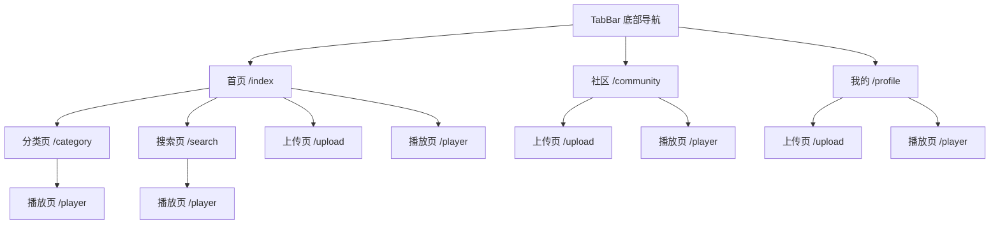

# 前端开发文档

## 技术栈

| 技术 | 版本/说明 |
|------|-----------|
| 微信小程序框架 | 基础库 3.3.4+ |
| 云开发 SDK | wx-server-sdk |
| WXML + WXSS | 小程序原生模板和样式 |
| JavaScript (ES6+) | async/await、箭头函数、模板字符串 |

---

## 页面结构

### 页面导航图



### TabBar 配置

| Tab | 页面路径 | 文字 | 选中色 |
|-----|---------|------|--------|
| 首页 | pages/index/index | 首页 | #6c63ff |
| 社区 | pages/community/community | 社区 | #6c63ff |
| 我的 | pages/profile/profile | 我的 | #6c63ff |

---

## 页面详细说明

### 1. 首页 (pages/index/index)

**功能**：展示音游分类 + 最新视频

| 功能模块 | 说明 |
|---------|------|
| 音游分类列表 | 从 `game` 集合读取分类，首次运行时写入默认 7 个分类 |
| 最新视频 | 从 `video` 集合取最新 6 条，按 `createTime` 降序 |
| 搜索跳转 | 输入关键词跳转搜索页 |
| 上传跳转 | 点击按钮跳转上传页 |
| 下拉刷新 | `onPullDownRefresh` 刷新分类和视频 |
| 封面链接 | 通过 `wx.cloud.getTempFileURL` 获取临时封面链接 |

**关键数据流**：
```
onLoad → loadGames() → db.collection('game').orderBy('sort','asc').get()
       → loadRecentVideos() → db.collection('video').orderBy('createTime','desc').limit(6).get()
       → fillThumbUrls() → wx.cloud.getTempFileURL()
```

---

### 2. 分类页 (pages/category/category)

**功能**：展示某音游下所有视频，支持分页和排序

| 功能模块 | 说明 |
|---------|------|
| 分类过滤 | 根据 `gameId` 过滤视频列表 |
| 分页加载 | `onReachBottom` 触发下一页，每页 10 条 |
| 排序切换 | 按时间 (`createTime`) 或歌名 (`songName`) 排序 |
| 下拉刷新 | 重置分页并重新加载 |

**参数传递**：
```
onGameTap → navigateTo /pages/category/category?gameId=${gameId}&gameName=${gameName}
```

---

### 3. 搜索页 (pages/search/search)

**功能**：模糊搜索视频歌名，高亮匹配关键词

| 功能模块 | 说明 |
|---------|------|
| 正则搜索 | 使用 `db.RegExp({ regexp: kw, options: 'i' })` 实现不区分大小写搜索 |
| 结果高亮 | `highlightMatch()` 将匹配片段用 `<b>` 标签加粗，颜色 #6c63ff |
| 封面链接 | `fillThumbUrls()` 批量获取临时封面链接 |

**搜索限制**：最多返回 30 条结果

---

### 4. 上传页 (pages/upload/upload)

**功能**：上传视频 + 封面到云存储，写入数据库

| 功能模块 | 说明 |
|---------|------|
| 音游分类选择 | Picker 选择器，从 `game` 集合获取 |
| 选择视频 | `wx.chooseMedia`，仅允许从相册选择，最长 10 分钟 |
| AI 润色 | 调用 `aiPolish` 云函数，超时 20 秒 |
| 三步上传 | ① 上传视频 → ② 上传封面 → ③ 写入 `video` 集合 |
| 进度追踪 | `uploadStep` 和 `uploadProgress` 跟踪上传阶段 |
| 验证 | 歌名和视频必填 |

**上传流程**：
```
validate() → getOpenid()
  → wx.cloud.uploadFile(cloudPath: videos/${openid}/${ts}.${ext})
  → wx.cloud.uploadFile(cloudPath: thumbs/${openid}/${ts}.${ext}) [可选封面]
  → db.collection('video').add({...})
  → db.collection('game').doc(gameId).update({videoCount: +1})
  → navigateBack()
```

---

### 5. 播放页 (pages/player/player)

**功能**：视频播放 + 变速 + AB 循环 + 评论 + 收藏

| 功能模块 | 说明 |
|---------|------|
| 视频播放 | 通过 `wx.cloud.getTempFileURL` 获取临时链接播放 |
| 变速 | 支持 0.5x / 0.75x / 1.0x / 1.25x / 1.5x |
| AB 循环 | 标记 A/B 点，200ms 间隔检测循环，自动回到 A 点 |
| 进度条 | 自定义 slider 控件，支持拖拽定位 |
| 全屏 | CSS 模拟全屏模式 |
| 评论 | 分页加载 + 发布评论（直接写 `comment` 集合） |
| 收藏 | 切换收藏状态，写入/删除 `favorite` 集合 |

**AB 循环逻辑**：
```
setPointA() → 记录 currentTime，A < B
setPointB() → 记录 currentTime，B > A
toggleLoop() → 开启时 seek(A)，每 200ms 检查 currentTime >= B → seek(A) + loopCount++
clearAB() → 清除所有标记
```

---

### 6. 社区页 (pages/community/community)

**功能**：展示所有用户上传的视频，按时间降序分页

| 功能模块 | 说明 |
|---------|------|
| 全部视频 | 不过滤 `gameId`，读取全部视频 |
| 分页加载 | 每页 10 条，`onReachBottom` 加载更多 |
| 下拉刷新 | 重置列表 |
| 上传跳转 | 顶部按钮跳转上传页 |

---

### 7. 个人中心 (pages/profile/profile)

**功能**：展示用户信息 + 我的视频 + 我的收藏

| 功能模块 | 说明 |
|---------|------|
| 双 Tab | `videos`（我的视频） / `favorites`（我的收藏） |
| 我的视频 | `db.collection('video').where({openid})` 查询 |
| 我的收藏 | `db.collection('favorite').where({openid})` 查询 |
| 取消收藏 | `db.collection('favorite').doc(favId).remove()` |
| 删除视频 | ① 删除数据库记录 ② 更新 game.videoCount(-1) ③ 删除云存储文件 |
| 用户信息 | 从 `app.globalData.userInfo` 获取昵称和头像 |

**删除视频流程**：
```
onDeleteVideo → showModal 确认
  → db.collection('video').doc(videoId).remove()
  → db.collection('game').doc(gameId).update({videoCount: -1})
  → wx.cloud.deleteFile({fileList: [videoFileId, thumbFileId]})
  → 本地列表移除
```

---

## 全局数据 (app.globalData)

| 字段 | 类型 | 说明 |
|------|------|------|
| openid | string/null | 当前用户 openid，`login()` 后填充 |
| userInfo | object/null | 微信用户信息（昵称、头像） |
| loginCallback | function/null | 登录完成回调，用于异步等待 openid |
| envId | string | 云开发环境 ID: `cloud1-d5g80cjzo4df8c3c8` |
| defaultGames | array | 7 个预设音游分类 |

---

## 公共函数

### fillThumbUrls(list)

**位置**：index.js / category.js / community.js / profile.js 中各自定义

**作用**：批量获取视频封面的临时链接

```
输入：视频列表（每项含 thumbFileId）
处理：wx.cloud.getTempFileURL({ fileList: fileIds })
输出：补充 thumbUrl 字段的视频列表
```

### formatDuration(sec)

**作用**：将秒数格式化为 `MM:SS` 格式

### formatTime(date)

**作用**：将日期格式化为相对时间（刚刚 / X分钟前 / X小时前 / X天前 / 日期）

---

## 样式主题

| 配置项 | 值 |
|--------|-----|
| 导航栏背景色 | #1a1a2e |
| 导航栏文字色 | white |
| 选中色 | #6c63ff |
| 未选中色 | #888 |
| 页面背景色 | #f5f5f5 |
