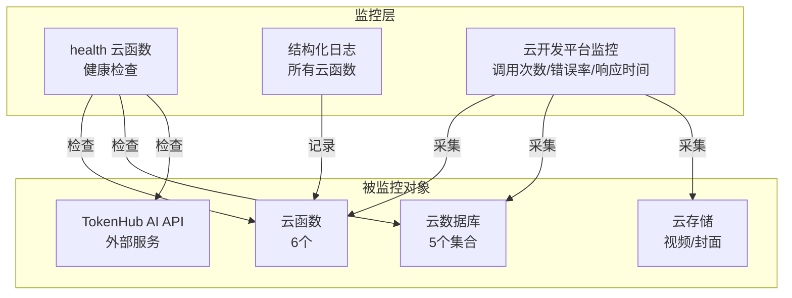

# 监控配置说明文档

## 监控概述

本项目实现了**多层监控体系**，包括健康检查、结构化日志、云开发平台监控等，确保服务稳定运行。

---

## 监控架构



---

## 健康检查

### 实现方式

通过 `health` 云函数实现健康检查，定期检查系统各组件状态。

**文件位置**：`cloudfunctions/health/index.js`

### 检查项

| 检查项 | 方法 | 说明 |
|--------|------|------|
| **数据库连通性** | `db.collection('user').limit(1).get()` | 检查云数据库是否正常响应 |
| **环境变量配置** | `process.env.TOKENHUB_API_KEY` | 检查 AI API Key 是否配置 |

### 调用方式

**1. 通过小程序调用（可选）**

```javascript
wx.cloud.callFunction({
  name: 'health'
}).then(res => {
  console.log('系统状态：', res.result.data.status);
});
```

**2. 通过云开发控制台测试**

1. 打开云开发控制台
2. 点击 **"云函数"**
3. 找到 `health` 函数
4. 点击 **"测试"** 按钮
5. 查看返回结果

### 返回格式

**成功响应（系统健康）**：

```json
{
  "code": 0,
  "data": {
    "status": "healthy",
    "timestamp": "2026-06-28T00:00:00.000Z",
    "version": "1.0.0",
    "env": "development",
    "checks": {
      "database": "connected",
      "envVars": {
        "TOKENHUB_API_KEY": true
      }
    },
    "uptime": 123.456
  }
}
```

**成功响应（系统降级）**：

```json
{
  "code": 0,
  "data": {
    "status": "degraded",
    "timestamp": "2026-06-28T00:00:00.000Z",
    "version": "1.0.0",
    "checks": {
      "database": "disconnected",
      "envVars": {
        "TOKENHUB_API_KEY": false
      }
    }
  }
}
```

**失败响应**：

```json
{
  "code": -1,
  "msg": "健康检查失败",
  "error": "具体错误信息"
}
```

---

## 结构化日志

### 实现方式

所有云函数都使用统一的 `structuredLog` 函数记录日志，输出 JSON 格式的结构化日志。

**示例代码**（以 `aiPolish` 云函数为例）：

```javascript
function structuredLog(level, message, extra = {}) {
  const entry = {
    time: new Date().toISOString(),
    level: level,
    service: 'aiPolish',
    message: message,
    ...extra,
  };
  if (level === 'ERROR') {
    console.error(JSON.stringify(entry));
  } else if (level === 'WARN') {
    console.warn(JSON.stringify(entry));
  } else {
    console.log(JSON.stringify(entry));
  }
}
```

### 日志级别

| 级别 | 说明 | 使用场景 |
|------|------|---------|
| `INFO` | 信息日志 | 正常业务流程（如"请求开始"、"润色成功"） |
| `WARN` | 警告日志 | 可恢复的错误（如"输入内容超长"、"未授权调用"） |
| `ERROR` | 错误日志 | 不可恢复的错误（如"AI API 错误"、"数据库连接异常"） |

### 日志示例

**INFO 日志**：

```json
{
  "time": "2026-06-28T00:00:00.000Z",
  "level": "INFO",
  "service": "aiPolish",
  "message": "aiPolish 请求开始",
  "hasText": true,
  "textLength": 50,
  "hasSongName": true,
  "hasGameName": false
}
```

**ERROR 日志**：

```json
{
  "time": "2026-06-28T00:00:00.000Z",
  "level": "ERROR",
  "service": "aiPolish",
  "message": "TokenHub API 错误",
  "error": "Unauthorized"
}
```

### 日志查看

**方法 1：通过云开发控制台**

1. 打开云开发控制台
2. 点击 **"云函数"**
3. 找到对应云函数
4. 点击 **"日志"** 标签
5. 查看最近的调用日志

**方法 2：通过小程序开发者工具**

1. 打开微信开发者工具
2. 点击 **"调试器"**
3. 查看 `Console` 标签页（仅本地调试时）

---

## 云开发平台监控

微信云开发平台自带**监控图表**，无需额外配置。

### 监控指标

| 指标 | 说明 | 查看位置 |
|------|------|---------|
| **调用次数** | 云函数被调用的总次数 | 云开发控制台 → 云函数 → 监控 |
| **错误率** | 云函数调用失败的比例 | 云开发控制台 → 云函数 → 监控 |
| **响应时间** | 云函数平均响应时间 | 云开发控制台 → 云函数 → 监控 |
| **数据库操作次数** | 读/写操作次数 | 云开发控制台 → 数据库 → 监控 |
| **云存储使用量** | 存储空间占用 | 云开发控制台 → 云存储 → 监控 |

### 查看方法

1. 打开云开发控制台
2. 点击 **"监控"** 标签
3. 选择时间范围（最近 1 小时、最近 24 小时、最近 7 天等）
4. 查看各项监控指标图表

---

## 告警配置（可选）

微信云开发平台支持**告警通知**，当出现异常时自动发送通知。

### 配置步骤

1. 打开云开发控制台
2. 点击 **"设置"** → **"告警设置"**
3. 点击 **"添加告警规则"**
4. 选择监控指标（如"云函数错误率"）
5. 设置阈值（如"错误率 > 10%"）
6. 选择通知方式（微信通知、邮件、短信）
7. 点击 **"确定"**

### 建议配置的告警规则

| 告警规则 | 阈值 | 通知方式 |
|---------|------|---------|
| 云函数错误率过高 | 错误率 > 10% | 微信通知 + 邮件 |
| 云函数响应时间过长 | 平均响应时间 > 5 秒 | 微信通知 |
| 数据库操作次数即将超限 | 使用量 > 80% 配额 | 邮件 |
| 云存储容量即将超限 | 使用量 > 80% 配额 | 邮件 |

---

## 监控数据收集

### 自动化收集（CI/CD）

通过 GitHub Actions 实现自动化监控数据收集：

**文件位置**：`.github/workflows/monitoring.yml`（可选）

**功能**：
- 定时调用 `health` 云函数
- 记录系统状态到日志文件
- 生成监控报告

### 手动收集

在小程序中调用 `health` 云函数，获取当前系统状态：

```javascript
wx.cloud.callFunction({
  name: 'health'
}).then(res => {
  const data = res.result.data;
  console.log('系统状态：', data.status);
  console.log('数据库：', data.checks.database);
  console.log('AI API Key 配置：', data.checks.envVars.TOKENHUB_API_KEY);
});
```

---

## 监控报告

### 报告内容

| 章节 | 内容 |
|------|------|
| **系统状态** | healthy / degraded |
| **数据库状态** | connected / disconnected |
| **环境变量检查** | TOKENHUB_API_KEY 是否配置 |
| **云函数调用统计** | 各云函数的调用次数、错误率、平均响应时间 |
| **数据库操作统计** | 读/写操作次数 |
| **云存储使用统计** | 存储容量、文件数量 |

### 生成方式

**自动生成**（推荐）：

通过 GitHub Actions 定时任务，每天自动生成监控报告并推送到仓库。

**手动生成**：

在云开发控制台中导出监控数据，然后手动整理成报告。

---

## 故障排查

### 常见问题

| 问题 | 可能原因 | 排查方法 |
|------|---------|---------|
| `health` 返回 `status: degraded` | 数据库断开连接 | 检查云开发环境是否正常运行 |
| `TOKENHUB_API_KEY: false` | 环境变量未配置 | 在云开发控制台中配置环境变量 |
| 云函数调用失败 | 代码错误、超时、内存不足 | 查看云函数日志 |
| 数据库操作失败 | 权限错误、配额超限 | 检查数据库权限设置和使用量 |
| AI 润色功能不可用 | API Key 错误、网络问题 | 检查环境变量和网络连接 |

### 排查步骤

1. **查看云函数日志**（在云开发控制台中）
2. **调用 `health` 云函数**（检查系统状态）
3. **检查环境变量配置**（确保 API Key 已配置）
4. **检查数据库权限**（确保前端有读写权限）
5. **查看监控图表**（分析调用次数、错误率、响应时间）

---

## 监控最佳实践

1. **定期检查 `health` 云函数**：建议每天至少检查一次系统状态
2. **配置告警通知**：当出现问题时及时收到通知
3. **保留日志**：结构化日志便于问题排查和数据分析
4. **监控配额使用量**：避免超出免费额度导致服务不可用
5. **测试环境与现实环境分开监控**：避免测试数据干扰生产监控

